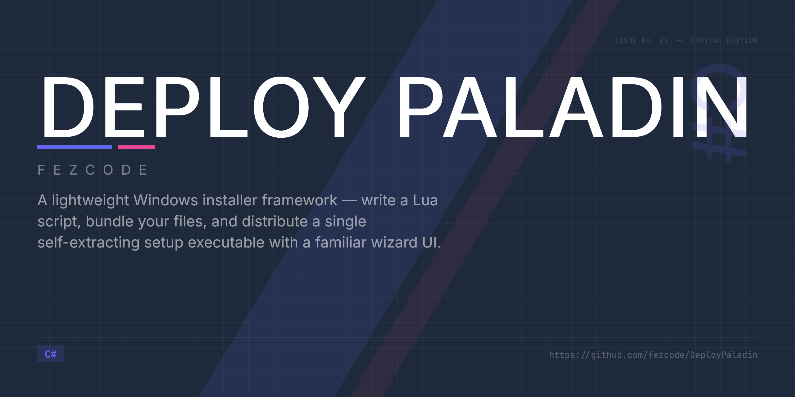

# Deploy Paladin



A lightweight installer framework for Windows applications. Write a Lua script describing your installer wizard, bundle it with your files, and distribute a single setup executable.


## Projects

| Project | Type | Description |
|---|---|---|
| `DeployPaladin` | WinExe (Avalonia) | The installer UI engine — runs the wizard, extracts files, writes registry keys |
| `DeployPaladin.Builder` | Console | CLI tool that bundles a payload folder into a self-extracting installer |

## Prerequisites

- [.NET 9 SDK](https://dotnet.microsoft.com/download/dotnet/9.0) (for building from source)
- Windows (registry features are Windows-only)

## Quick Start

### 1. Publish both tools

```powershell
# Publish the installer engine (base exe that becomes each setup.exe)
dotnet publish DeployPaladin.csproj -c Release -r win-x64 --self-contained -o .\publish

# Publish the builder CLI (standalone, no .NET required to run)
dotnet publish DeployPaladin.Builder\DeployPaladin.Builder.csproj -c Release -o .\publish-builder
```

This gives you two standalone executables:
- `publish\DeployPaladin.exe` — the base installer engine
- `publish-builder\DeployPaladin.Builder.exe` — the builder CLI (~13 MB, self-contained, no .NET runtime needed)

You can copy both files anywhere. The builder is a standalone tool — put it on a build server, a USB stick, or wherever you create installers.

### 2. Prepare a payload folder

Create a folder with your application files, a `LICENSE.txt`, and an `installer.lua` script:

```
MyAppInstaller/
├── installer.lua
├── LICENSE.txt
├── icon.ico
├── MyApp.exe
├── library.dll
└── assets/
    └── ...
```

### 3. Write installer.lua

```lua
SetMetadata("AppName", "My Application")
SetMetadata("Version", "1.0.0")
SetMetadata("Company", "My Company")

SetTheme("Windows11")       -- "Windows11" or "Aqua"
SetInstallDirSuffix("MyApp")
SetAppIcon("icon.ico")      -- optional: custom window icon

AddStep("Welcome", { title = "Welcome", description = "Click Next to begin." })
AddStep("License", { title = "License", description = "Review the terms.", contentFile = "LICENSE.txt" })
AddStep("Folder",  { title = "Location", description = "Choose install folder." })
AddStep("Shortcuts", { title = "Shortcuts", description = "Choose optional shortcuts." })
AddStep("Install", { title = "Installing...", description = "Please wait." })
AddStep("Finish",  { title = "Done!", description = "Installation complete." })

MkDir("%INSTALLDIR%")
CopyFiles("MyApp.exe", "%INSTALLDIR%/MyApp.exe")
CopyFiles("library.dll", "%INSTALLDIR%/library.dll")
CopyDir("assets", "%INSTALLDIR%/assets")

CreateShortcut("%INSTALLDIR%/MyApp.exe", "%DESKTOP%", "My Application",
    { label = "Create Desktop Shortcut", isOptional = true, isSelected = true, icon = "%INSTALLDIR%/icon.ico" })
CreateShortcut("%INSTALLDIR%/MyApp.exe", "%STARTMENU%", "My Application")

CheckRegistry("HKCU", "Software\\MyCompany\\MyApp", "InstallDir")
CreateRegistry("HKCU", "Software\\MyCompany\\MyApp", "InstallDir", "%INSTALLDIR%")
```

### 4. Build the bundled installer

```powershell
DeployPaladin.Builder.exe --payload .\MyAppInstaller --base .\DeployPaladin.exe --output .\MyApp_Setup.exe
```

Or from the repo with the SDK:

```powershell
dotnet run --project DeployPaladin.Builder -- --payload .\MyAppInstaller --base .\publish\DeployPaladin.exe --output .\MyApp_Setup.exe
```

| Flag | Short | Description |
|---|---|---|
| `--payload` | `-p` | Folder containing `installer.lua`, `LICENSE.txt`, and all files to install |
| `--base` | `-b` | Path to the published DeployPaladin installer executable |
| `--output` | `-o` | Path for the output bundled setup executable |
| `--help` | `-h` | Show help |

This produces a single `MyApp_Setup.exe` that contains the installer engine and all your payload files.

### 5. Distribute

Ship `MyApp_Setup.exe`. End users double-click it and get a familiar wizard experience.

## Development (running without a bundle)

During development you can run the installer UI directly. It will look for `installer.lua` and payload files relative to the executable's directory:

```powershell
dotnet run --project DeployPaladin.csproj
```

## Lua Script API

### Metadata

| Function | Description |
|---|---|
| `SetMetadata("AppName", "...")` | Application name shown in the title bar |
| `SetMetadata("Version", "...")` | Version string |
| `SetMetadata("Company", "...")` | Company name |
| `SetTheme("Windows11")` | UI theme — `"Windows11"` or `"Aqua"` |
| `SetInstallDirSuffix("...")` | Subfolder appended to the chosen install directory |
| `SetAppIcon("icon.ico")` | Custom window icon (`.ico` file from the payload) |

### Wizard Steps

```lua
AddStep(type, { title = "...", description = "...", contentFile = "..." })
```

Step types: `Welcome`, `License`, `Folder`, `Shortcuts`, `Install`, `Finish`

| Option | Description |
|---|---|
| `contentFile` | Loads a text file (e.g., `LICENSE.txt`) and displays it in a scrollable box on that step |
| `requireScroll` | When `true`, the user must scroll to the bottom before they can proceed (useful for license steps) |

The `Shortcuts` step displays checkboxes for any optional shortcut actions (those with `isOptional = true`), letting the user choose which shortcuts to create before installation begins.

### Install Actions

| Function | Description |
|---|---|
| `MkDir("%INSTALLDIR%")` | Create a directory |
| `CopyFiles("source", "dest")` | Copy/extract a single file from the payload to disk |
| `CopyDir("sourceDir", "destDir")` | Copy/extract an entire directory from the payload to disk (preserves subfolder structure) |
| `CreateShortcut(target, location, name, options?)` | Create a `.lnk` shortcut (see below) |
| `CreateRegistry("HKCU", "key", "value", "data")` | Write a registry value |
| `CheckRegistry("HKCU", "key", "value")` | Check if already installed (shows reinstall/uninstall prompt) |

#### CreateShortcut options

```lua
CreateShortcut("%INSTALLDIR%/App.exe", "%DESKTOP%", "My App", {
    label      = "Create Desktop Shortcut",  -- display text on the Shortcuts step
    isOptional = true,                        -- show as a user-toggleable checkbox
    isSelected = true,                        -- default checkbox state (default: true)
    icon       = "%INSTALLDIR%/icon.ico"      -- optional shortcut icon
})
```

When `isOptional` is `false` (the default), the shortcut is always created. When `true`, it appears as a checkbox on the `Shortcuts` wizard step so the user can opt in or out.

### Path Variables

| Variable | Expands to |
|---|---|
| `%INSTALLDIR%` | The user's chosen install directory + suffix |
| `%PROGRAMFILES%` | `C:\Program Files` |
| `%LOCALAPPDATA%` | `C:\Users\<user>\AppData\Local` |
| `%DESKTOP%` | User's desktop folder |
| `%STARTMENU%` | `C:\Users\<user>\AppData\Roaming\Microsoft\Windows\Start Menu\Programs` |
| `%SYSTEM%` | `C:\Windows\System32` |

## Bundle Format

The builder appends data to the end of the base executable:

```
[original exe bytes] [zip payload] [zip length: 4 bytes, int32] [magic: "PLDN"]
```

At runtime, `BundleReader` seeks to the end of its own exe, finds the `PLDN` marker, reads the zip length, and loads the payload into memory.

## License

MIT
